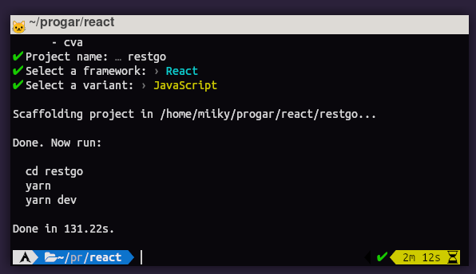
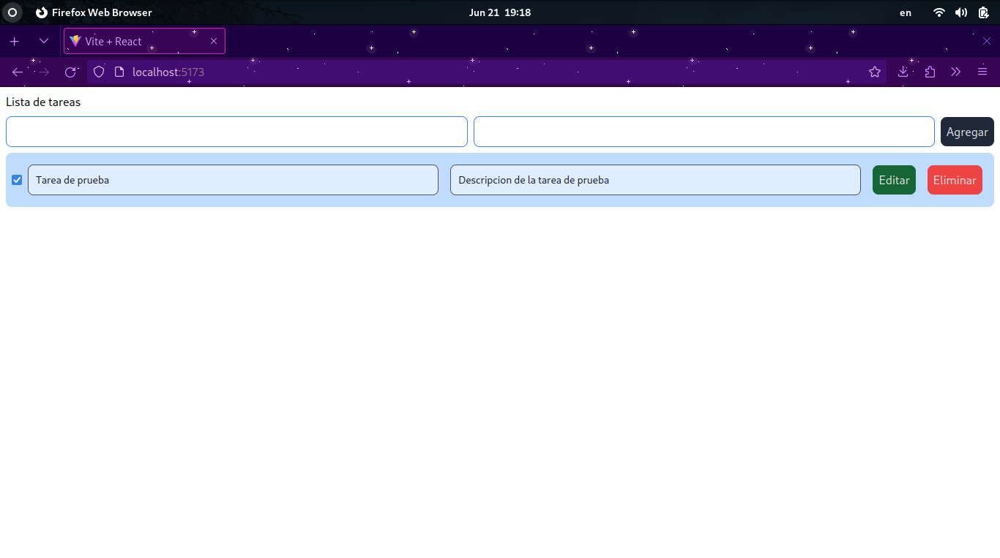

# Explicación rápida
Dando continuación al servicio REST que cree con Go por los jajas, es momento de hacer un cliente capaz de consumirlo, este cliente en principio tiene algunos defectos, pero puede dar una idea de como puede ser consumida esta API, o incluso otras utilizando las tecnologías web.
## Que es React?
[ReactJS](https://react.dev/) es una de las librerías más populares de JavaScript para el desarrollo de aplicaciones móviles y web. Creada por Facebook, React contiene una colección de fragmentos de código JavaScript re-utilizables utilizados para crear interfaces de usuario (UI) llamadas componentes.[Hostinger ¿Que es React?](https://www.hostinger.mx/tutoriales/que-es-react)
## Que es Vite?
Vite es una herramienta de compilación que tiene como objetivo proporcionar una experiencia de desarrollo más rápida y sencilla para proyectos web modernos.
[Vite guide](https://vitejs.dev/guide/)
# Creación del proyecto con yarn
Siguiendo la guia de vitejs [vitejs.dev](https://vitejs.dev/guide/) para la creación de un proyecto usando vite.
Yo usare `yarn` en lugar de `npm`.
```bash
yarn create vite
```
O con npm:
```bash
npm create vite@latest
```
Esto nos mostrara una interfaz de terminal en la cual tendremos que darle un nombre al proyecto...

Que tecnología usare, en mi caso usare react...

Y el lenguaje a usar en el proyecto, en mi caso usare JavaScript por comodidad.

Y listo, ya habremos creado el proyecto.

# Instalando dependencias y configurándolas
Para que mi interfaz no se vea tan fea, agregare la libreria de tailwind.css.
```bash
yarn add -D tailwindcss postcss autoprefixer
```
Con npm:
```bash
npm install -D tailwindcss postcss autoprefixer
```
De acuerdo a la pagina de talwind.css y para configurarlo en proyectos de vite son necesarios esas librerias. Y ejecutar la siguiente linea para que se configuren y agreguen los archivos necesarios para tailwind.
```bash
yarn tailwindcss init -p
```
o
```bash
npx tailwindcss init -p
```
## Configuración propia de tailwind
Después es necesario sustituir estas lineas en `tailwind.config.js` archivo que se ha generado con la instrucción anterior:
```js
/** @type {import('tailwindcss').Config} */
export default {
  content: [],
  theme: {
    extend: {},
  },
  plugins: [],
}
```
Y tiene que quedar asi:
```js
/** @type {import('tailwindcss').Config} */
export default {
  content: [
    "./index.html",
    "./src/**/*.{js,ts,jsx,tsx}",
  ],
  theme: {
    extend: {},
  },
  plugins: [],
}
```
## Configuración en index.css
Para que el proyecto use tailwind es necesario sustituir todo lo que este en el archivo `index.css` que se ubica en `src`, eliminar todo y agregar esto:
```css
@tailwind base;
@tailwind components;
@tailwind utilities;
```
# Variable de entorno
Solo usare una variable de entorno para no tener que escribir todo el tiempo la dirección de mi servidor REST. Y poder cambiarlo en caso de que sea necesario.
```dosini
VITE_SERVER=http://localhost:3000
```
# Creando asset de tarea.
Este sera un componente que almacenara la información de la tarea, este componente se encargara de editar, eliminar, y marcar como completada esa tarea.
```jsx
import { useState } from "react";

export const Task = ({ id, title, desc, stat }) => {
    const [isEdit, setIsEdit] = useState(true)

    const [status, setStat] = useState(stat)
    const [tast, setTitle] = useState(title)
    const [description, setDesc] = useState(desc)

    const handleChangeStatus = () => {
        setStat(!status);
        fetch(import.meta.env.VITE_SERVER+"/task/"+id, {
            method: "PATCH",
            body: JSON.stringify({}),
            headers:{}
        }).then((response) => response.json)
        .then(json => console.log(json))
    };

    const handleChangeTitle = (event) => {
        setTitle(event.target.value);
    }

    const handleChangeDesc = (event) => {
        setDesc(event.target.value);
    }

    const btnEdit = () => {
        setIsEdit(!isEdit)
    }

    const btnDelete = () => {
        console.log("Listo para eliminar");
        fetch(import.meta.env.VITE_SERVER+"/task/"+id, {
            method: "DELETE",
            body: JSON.stringify({}),
            headers:{}
        }).then((response) => response.json)
        .then(json => console.log(json))
    }

    const btnSave = () => {
        fetch(import.meta.env.VITE_SERVER+"/task/"+id, {
            method: "PUT",
            body: JSON.stringify({
                title: tast,
                desc: description
            }),
            headers:{
                "Content-type": "application/json; charset=UTF-8"
            }
        }).then((response) => response.json)
        .then(json => console.log(json))
    }

    return (
        <div className="flex flex-row items-center">
            <input
                type="checkbox"
                className="form-checkbox h-5 w-5 text-green-800 transition duration-150 ease-in-out"
                checked={status}
                onChange={handleChangeStatus}
            />
            <input disabled={isEdit} className={`bg-${isEdit ? 'gray-200' : 'grey-200'} border ${isEdit ? 'border-gray-600' : 'border-blue-500'} text-gray-900 text-sm rounded-lg focus:ring-blue-500 focus:border-blue-500 block w-full p-2.5 m-2`} defaultValue={title} onChange={handleChangeTitle} type="text" name="" id="" />
            <input disabled={isEdit} className={`bg-${isEdit ? 'gray-200' : 'grey-200'} border ${isEdit ? 'border-gray-600' : 'border-blue-500'} text-gray-900 text-sm rounded-lg focus:ring-blue-500 focus:border-blue-500 block w-full p-2.5 m-2`} defaultValue={desc} onChange={handleChangeDesc} type="text" name="" id="" />
            <button className="bg-green-800 text-gray-200 p-2 m-2 rounded-lg" onClick={btnEdit}>Editar</button>
            <button className={`${isEdit ? 'bg-red-500' : 'bg-blue-500'} text-gray-200 p-2 m-2 rounded-lg`} onClick={isEdit ? btnDelete : btnSave}>{isEdit ? 'Eliminar' : 'Guardar'}</button>
        </div>
    )
}
```
1. Importa el hook `useState` de la librería "react".
2. Define el componente `Task` que recibe las propiedades `id`, `title`, `desc` y `stat`.
3. Dentro del componente `Task`, utiliza el hook `useState` para crear los siguientes estados:
    - `isEdit`: estado que indica si el componente está en modo de edición o no.
    - `status`: estado que almacena el valor de la propiedad `stat`.
    - `tast`: estado que almacena el valor de la propiedad `title`.
    - `description`: estado que almacena el valor de la propiedad `desc`.
4. Crea una función `handleChangeStatus` que se ejecuta cuando cambia el estado del checkbox. Esta función invierte el valor de `status` y luego realiza una solicitud PATCH al servidor usando la función `fetch`. El servidor y la ruta están definidos en `import.meta.env.VITE_SERVER`, pero los detalles de la solicitud no están especificados en el código proporcionado.
5. Crea una función `handleChangeTitle` que se ejecuta cuando cambia el valor del input de título. Esta función actualiza el estado `tast` con el nuevo valor.
6. Crea una función `handleChangeDesc` que se ejecuta cuando cambia el valor del input de descripción. Esta función actualiza el estado `description` con el nuevo valor.
7. Crea una función `btnEdit` que se ejecuta al hacer clic en el botón "Editar". Esta función invierte el valor de `isEdit`, lo que cambia entre el modo de edición y el modo de visualización.
8. Crea una función `btnDelete` que se ejecuta al hacer clic en el botón "Eliminar" (o "Guardar" si `isEdit` es `false`). Esta función realiza una solicitud DELETE al servidor usando la función `fetch`. La ruta al recurso específico se construye utilizando el `id` proporcionado.
9. Crea una función `btnSave` que se ejecuta al hacer clic en el botón "Guardar" (solo cuando `isEdit` es `false`). Esta función realiza una solicitud PUT al servidor usando la función `fetch` para actualizar el recurso con el `id` proporcionado. La solicitud incluye el nuevo título y descripción en el cuerpo de la solicitud como un objeto JSON.
10. Renderiza el componente `Task` con los siguientes elementos:
    - Un checkbox que refleja el valor de `status` y llama a `handleChangeStatus` cuando cambia.
    - Dos inputs de texto para el título y la descripción. Estos inputs están deshabilitados si `isEdit` es `true` y llaman a `handleChangeTitle` y `handleChangeDesc` respectivamente cuando cambian.
    - Un botón "Editar" que llama a `btnEdit` al hacer clic.
    - Un botón "Eliminar" o "Guardar" que llama a `btnDelete` o `btnSave` respectivamente, dependiendo del valor de `isEdit`. El texto del botón también cambia en función de `isEdit`.

### Extra
El componente className sirve para darle estilo a los componentes y que estos no se vean planos y simples, este estilo lo podemos modificar gracias a tailwind :)

# Creacion de la pagina principal
En el archivo existente App.jsx sustiture casi todo...
```js
import { useEffect, useState } from 'react'
import { Task } from './assets/task'

const url = import.meta.env.VITE_SERVER+"/tasks"

function App() {
    const [tasks, setTasks] = useState([])

    const [task, setTask] = useState('')
    const [desc, setDesc] = useState('')

    useEffect(
        () => {
            update()
        }, []
    )
    const update = async () => {
        const fetchdata = async () => {
            const result = await fetch(url)
            const json = await result.json()
            setTasks(json)
        }
        fetchdata()
    }

    const handleTask = (event) => {
        setTask(event.target.value)
    }
    const handleDesc = (event) => {
        setDesc(event.target.value)
    }

    const btnAdd = () => {
        fetch(import.meta.env.VITE_SERVER+"/task", {
            method: "POST",
            body: JSON.stringify({
                title: task,
                desc: desc
            }),
            headers:{
                "Content-type": "application/json; charset=UTF-8"
            }
        }).then((response) => response.json)
        .then(json => console.log(json))
        update()
    }

    return (
        <div className='m-2'>
            <h1>Lista de tareas</h1>
            <div className='flex flex-row items-center my-2'>
                <input onChange={handleTask} className='bg-grey-200 border border-blue-500 text-gray-900 text-sm rounded-lg focus:ring-blue-500 focus:border-blue-500 block w-full p-2.5 mr-2' type="text" name="" id="" />
                <input onChange={handleDesc} className='bg-grey-200 border border-blue-500 text-gray-900 text-sm rounded-lg focus:ring-blue-500 focus:border-blue-500 block w-full p-2.5' type="text" name="" id="" />
                <button onClick={btnAdd} className='bg-gray-800 text-gray-200 p-2 ml-2 rounded-lg'>Agregar</button>
            </div>
            <div className='bg-blue-200 p-2 rounded-lg'>
            {tasks.map((task) => (
                <Task id={task.ID} title={task.title} desc={task.desc} stat={task.stat}></Task>
            ))}
            </div>
        </div>
    )
}

export default App
```
1. Importa el hook `useEffect` y el hook `useState` de la librería "react".
2. Importa el componente `Task` desde el archivo "./assets/task".
3. Define la constante `url` que almacena la URL del servidor a través de la variable de entorno `import.meta.env.VITE_SERVER`.
4. Crea el componente `App`.
5. Dentro del componente `App`, utiliza el hook `useState` para crear los siguientes estados:
    - `tasks`: estado que almacena un array de tareas.
    - `task`: estado que almacena el valor del input de tarea.
    - `desc`: estado que almacena el valor del input de descripción.
6. Utiliza el hook `useEffect` para realizar una llamada inicial a la función `update` al cargar el componente. Esto se logra pasando un array vacío como segundo argumento al hook.
7. Define la función `update` como una función asíncrona que realiza una solicitud GET al servidor usando la función `fetch`. Luego, convierte la respuesta en formato JSON y actualiza el estado `tasks` con el resultado obtenido.
8. Crea las funciones `handleTask` y `handleDesc` que se ejecutan cuando cambian los valores de los inputs de tarea y descripción respectivamente. Estas funciones actualizan los estados `task` y `desc` con los nuevos valores.
9. Crea la función `btnAdd` que se ejecuta al hacer clic en el botón "Agregar". Esta función realiza una solicitud POST al servidor usando la función `fetch`. La ruta a la que se realiza la solicitud está definida en `import.meta.env.VITE_SERVER+"/task"`. La solicitud incluye el título y la descripción de la tarea en el cuerpo de la solicitud como un objeto JSON. Después de realizar la solicitud, se llama a la función `update` para actualizar la lista de tareas.
10. Renderiza el componente `App` con los siguientes elementos:
    - Un título "Lista de tareas".
    - Un contenedor que contiene un input para la tarea, un input para la descripción y un botón "Agregar". Los inputs llaman a las funciones `handleTask` y `handleDesc` respectivamente cuando cambian.
    - Un contenedor que muestra las tareas. Utiliza el método `map` en el estado `tasks` para generar un componente `Task` para cada tarea en el array. Se pasan las propiedades `id`, `title`, `desc` y `stat` a cada componente `Task`.
11. Exporta el componente `App` como el componente principal por defecto.

# Funcionamiento
Para poner a funcionar el cliente, lo podemos hacer con 
```
yarn dev
```
o 
```
npm run dev
``` 
en caso de que estés usando npm.
## Y listo :)

Siempre y cuando el servicio REST este en funcionamiento podrás ejecutar el cliente de la lista de tareas.
### Agregar tareas

Agregar tareas, solamente tendrás que actualizar la pagina para que se actualize la vista.

### Editarlas

Podrás editarlas después de presionar el botón de editar y guardar los cambios con el botón guardar.
### Marcar como completado

### Eliminar
Al igual que al agregar nuevas tareas hay que actualizar la pagina :(
